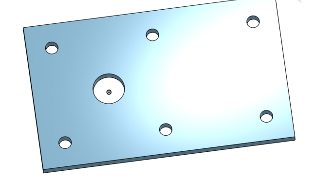

# Basic_Onshape_CAD
#Hello Onshape
##What I learned

[base](https://cvilleschools.onshape.com/documents/ce773a82bd964b97c2ca363a/w/c0f01d6acc032f33e236332b/e/3a7ee1ac464f60314d4e3d94)
The base was kind of hard for me because it was the first time using ONSHAPE, but i figured it out just by watching the videos a couple times and pausing in between steps.

[mount](https://cvilleschools.onshape.com/documents/270684b662ebbf6e21ea5604/w/d6754c3934b1a368534ac179/e/d8cd62fd429e31c23ecb79df)
This one was a lot easier because it was basically the same as the base but with less holes and a smaller rectangle.
